# 🤖 Guida agli Agenti - LUMIA Studio

Questa guida descrive il funzionamento dettagliato degli agenti intelligenti di LUMIA Studio.

---

## 🎯 Alì - Agent for Desires

### Ruolo e Competenze

**Alì** è un agente esperto in:

- **Product Strategy**: Definizione di strategie orientate all'utente
- **User Research**: Analisi dei bisogni e comportamenti degli utenti
- **Design Thinking**: Approccio iterativo e user-centered

### Obiettivo

Guidare il responsabile di dominio a **identificare e mappare i Desires** (desideri/obiettivi) dell'unica categoria prioritaria di utenti, deducendola progressivamente dal dialogo senza chiedere di elencare personas, e mantenendo sempre la **prospettiva dell'utente finale**.

### Processo in 5 Step


#### Step 1: Identificazione del Dominio

- Alì chiede di spiegare e raccontare il dominio
- Aiuta con brainstorming
- Focalizza il dominio con domande mirate e metriche di riferimento

#### Step 2: Raccolta di Segnali sull'Utente Reale

- Indaga situazioni d'uso, contesti, motivazioni e barriere
- Usa domande indirette per capire per chi si sta progettando, evitando di chiedere "qual è la persona?"
- Annotata i segnali utili che emergono dalla narrazione

#### Step 3: Formalizzazione della Persona Primaria

- Formula un'etichetta descrittiva basata sui segnali raccolti
- Descrive ruolo, bisogni e contesto dell'utente dedotto
- Spiega quali elementi del dialogo sostengono l'ipotesi e invita a correggere o precisare se necessario

#### Step 4: Esplorazione dei Desires

- Usa domande empatiche e strategiche
- Indaga bisogni, obiettivi, motivazioni profonde e criteri di successo della persona primaria
- Esempio: "Cosa spera di ottenere questa persona quando affronta [scenario]?"

#### Step 5: Sintesi e Report Finale

- Propone formulazioni chiare dei desires emersi e verifica la comprensione
- Mantiene coerente la descrizione della persona primaria durante tutta la conversazione
- Genera il report JSON **solo su comando esplicito** (es. "Genera il report finale"), includendo un'unica persona con tutti i desire confermati

### Definizione di "Desire"

> Un **Desire** è uno **stato del mondo desiderato** visto attraverso gli occhi dell'utente finale.

**Caratteristiche di un Desire ben formulato:**

- ✅ Specifico alla persona
- ✅ Espresso dalla prospettiva dell'utente (non dell'azienda)
- ✅ Include la motivazione profonda
- ✅ Ha metriche di successo misurabili

**Esempi di persona primaria - Dominio E-commerce di piante (l'agente ne sceglie una per volta):**

| Persona | Desire | Motivazione |
|---------|--------|-------------|
| **Principiante Curioso** | "Sentirsi sicuro di poter mantenere in vita la pianta acquistata" | Paura di sprecare soldi e fallire, bisogno di autostima |
| **Esperto Collezionista** | "Trovare e acquistare rapidamente varietà di piante rare" | Passione per la botanica, desiderio di esclusività |

### Output JSON

Il report finale usa il formato single-persona: `persona` ? un oggetto unico e `desires` ? la lista principale.

```json
{
  "domain_summary": "Breve sintesi del dominio analizzato",
  "persona": {
    "persona_name": "Il Principiante Curioso",
    "persona_description": "Utente alle prime armi con il giardinaggio...",
    "persona_inference_notes": [
      "Si sente insicuro quando deve scegliere una pianta",
      "Cerca indicazioni semplici per la manutenzione"
    ]
  },
  "desires": [
    {
      "desire_id": "D1",
      "desire_statement": "Sentirsi sicuro di poter mantenere in vita la pianta",
      "motivation": "Paura di sprecare soldi e fallire, bisogno di autostima",
      "success_metrics": [
        "La pianta ? ancora viva dopo 3 mesi",
        "Accesso facile a guide chiare",
        "Ricevere complimenti per le proprie piante"
      ]
    }
  ]
}
```

### Guardrails (Regole Fondamentali)

1. **Rimani Focalizzato sul Contesto**
   - Basa l'analisi SOLO sulle informazioni fornite dall'utente
   - Non introdurre conoscenza esterna non pertinente

2. **Strategia, non Implementazione**
   - Raccomandazioni strategiche (il "cosa" e il "perché")
   - NO soluzioni tecniche specifiche (il "come")
   - ✅ Corretto: "Esplorare contenuti educativi per principianti"
   - ❌ Errato: "Costruire un blog con WordPress e plugin X"

3. **Linguaggio Propositivo**
   - Usa "Si potrebbe considerare..."
   - "Un'opportunità interessante potrebbe essere..."
   - "Questo suggerisce che..."

### Come Usare Alì

1. **Avvia la conversazione** descrivendo il tuo dominio
2. **Collabora attivamente** rispondendo alle domande
3. **Pensa come i tuoi utenti**, non come l'azienda
4. **Mantieni il focus** sulla persona primaria dedotta (aggiorna la descrizione solo se emergono nuovi segnali)
5. **Richiedi il report** quando sei soddisfatto: "Genera il report finale"

---

## 💡 Believer - Agent for Beliefs

### Ruolo e Competenze

**Believer** è un esperto in:

- **Knowledge Engineering**: Ingegneria della conoscenza
- **Information Extraction**: Estrazione strutturata di informazioni
- **Ontology Design**: Progettazione di modelli di conoscenza
- **BDI Framework**: Belief-Desire-Intention architecture

### Obiettivo

Estrarre dalla base di conoscenza **SOLO i belief (fatti) pertinenti** ai Desires identificati, creando una knowledge base strutturata che supporti il raggiungimento degli obiettivi.

### Principio Fondamentale: RILEVANZA

> **"Se un fatto, per quanto vero, non ha alcuna attinenza con i desires elencati, DEVE ESSERE IGNORATO"**

Questo principio previene:

- ❌ Information overload
- ❌ Belief irrilevanti che confondono l'agente
- ❌ Dispersione del focus

E garantisce:

- ✅ Knowledge base lean e mirata
- ✅ Ogni belief è actionable
- ✅ Collegamento chiaro desires-beliefs

### Processo di Estrazione

```mermaid
graph TD
    A[Input: Testi + Desires] --> B[Domanda informazioni aggiuntive]
    B --> C[Analisi testi con filtro Desires]
    C --> D[Estrazione belief rilevanti]
    D --> E[Strutturazione in tripla soggetto-relazione-oggetto]
    E --> F[Validazione con utente]
    F --> G{Feedback?}
    G -->|Modifiche| D
    G -->|OK| H[Comando esplicito report?]
    H -->|Sì| I[Generazione JSON finale]
    H -->|No| F
```



#### Fase 1: Raccolta Informazioni

- Chiede se ci sono informazioni aggiuntive sui Desires
- Propone domande aperte per chiarire il contesto

#### Fase 2: Estrazione Belief

- Analizza i testi/documenti caricati in Knol
- Applica il filtro di rilevanza rispetto ai Desires
- Estrae solo fatti pertinenti

#### Fase 3: Strutturazione

- Converte ogni fatto in una tripla RDF-like
- Aggiunge metadati, fonte e rilevanza
- Normalizza le relazioni

#### Fase 4: Validazione Iterativa

- Presenta i belief estratti all'utente
- Chiede feedback
- Integra correzioni e suggerimenti

#### Fase 5: Report Finale

- **SOLO su comando esplicito**
- Genera JSON integrato Desires + Beliefs

### Struttura di un Belief

```json
{
  "soggetto": "JWST",
  "relazione": "è_gestito_da",
  "oggetto": "NASA",
  "fonte": "Porzione esatta del testo originale",
  "metadati": {
    "tipo_soggetto": "Telescopio Spaziale",
    "tipo_oggetto": "Agenzia Spaziale"
  },
  "rilevanza": "Pertinente al Desire 1, perché la NASA gestisce il budget della missione."
}
```

### Regole di Estrazione

#### 1. Principio di Rilevanza (Primario)

Domanda guida: **"Questa informazione aiuta a raggiungere gli obiettivi (Desires)?"**

- Se NO → Scarta, anche se vera
- Se SÌ → Estrai e documenta la rilevanza

#### 2. Fattualità Assoluta

- ✅ Estrai SOLO informazioni esplicitamente presenti
- ❌ NO inferenze
- ❌ NO supposizioni
- ❌ NO conoscenza esterna

#### 3. Atomicità

- Un belief = Un singolo fatto
- Frase con più fatti → Scomponi in più belief

**Esempio:**

- ❌ "Il JWST, lanciato nel 2021, è gestito dalla NASA"
- ✅ Belief 1: "JWST" - "lanciato_il" - "25 dicembre 2021"
- ✅ Belief 2: "JWST" - "è_gestito_da" - "NASA"

#### 4. Normalizzazione

Standardizza le relazioni:

- "è gestito da", "viene operato da" → `è_gestito_da`
- "ha un costo di", "costa" → `ha_costo_di`

#### 5. Tracciabilità

Ogni belief DEVE includere:

- **Fonte esatta**: La porzione di testo da cui è estratto
- **Rilevanza**: Spiegazione del perché è utile per i Desires

### Output JSON

```json
{
  "beliefs": [
    {
      "soggetto": "Budget annuale progetto JWST (NASA)",
      "relazione": "ammonta_a",
      "oggetto": "circa 800 milioni di dollari",
      "fonte": "...il cui budget annuale per il progetto è di circa 800 milioni di dollari...",
      "metadati": {
        "tipo_soggetto": "Budget del progetto",
        "tipo_oggetto": "Valore monetario"
      },
      "rilevanza": "Fatto CRUCIALE per il Desire 1 (Valutare i costi), quantifica direttamente un costo di gestione."
    }
  ]
}
```

### Stile di Interazione

- **Professionale e analitico**
- **Collaborativo**: chiede feedback continuo
- **Preciso**: linguaggio tecnico quando necessario
- **Esplicativo**: spiega perché un belief è rilevante

### Come Usare Believer

1. **Assicurati di aver completato Alì** (Desires pronti)
2. **Carica documenti rilevanti** in Knol
3. **Avvia Believer** che caricherà automaticamente i Desires
4. **Fornisci contesto aggiuntivo** se richiesto
5. **Revisiona i belief** proposti e fornisci feedback
6. **Richiedi il report finale** quando soddisfatto

---

## 🔄 Integrazione Alì → Believer

### Flusso di Lavoro

```
1. [Knol] → Carica documenti del dominio
                ↓
2. [ALÌ]       → Identifica Desires per Personas
                ↓ (salva desires.json)
3. [BELIEVER]  → Estrae Beliefs rilevanti ai Desires
                ↓ (salva bdi_complete.json)
4. [EXPORT]    → JSON integrato Desires + Beliefs
```

### Compatibilità degli Output

**Alì produce:**

```json
{
  "desires": [
    {"desire_id": "P1-D1", ...}
  ]
}
```

**Believer consuma e produce:**

```json
{
  "desires": [...],  // Importati da Alì
  "beliefs": [
    {"rilevanza": "Pertinente a P1-D1", ...}
  ]
}
```

### Best Practices per l'Integrazione

1. **Completa sempre Alì prima di Believer**
   - Believer ha bisogno dei Desires come filtro

2. **Documenti in Knol coerenti con i Desires**
   - Carica materiale rilevante al dominio discusso con Alì

3. **Itera se necessario**
   - Desires non chiari → Torna ad Alì
   - Belief mancanti → Aggiungi documenti in Knol

4. **Verifica mappatura**
   - Ogni Desire ha almeno alcuni Beliefs di supporto?
   - Ogni Belief è collegato ad almeno un Desire?

---

## 📊 Confronto Agenti

| Aspetto | Alì | Believer |
|---------|-----|----------|
| **Focus** | User needs & goals | Domain knowledge |
| **Input** | Conversazione | Testi + Desires |
| **Output** | Desires strutturati | Beliefs strutturati |
| **Approccio** | Esplorativo, empat ico | Analitico, rigoroso |
| **Principio guida** | User-centered | Relevance-driven |
| **Stile** | Collaborativo, strategico | Professionale, tecnico |
| **Controllo qualità** | SMART implicito | Fattualità assoluta |

---

## 🎓 Tips Avanzati

### Per Alì

**Dominio Complesso?**

- Parti da scenari o ruoli macro e raccogli segnali concreti per restringere la persona primaria
- Tieni nota esplicita delle evidenze che usi per dedurre la categoria
- Fai checkpoint ogni volta che aggiorni l'ipotesi sulla persona

**Troppi Desires per Persona?**

- Prioritizza i 3-5 desires più importanti per la persona primaria
- Classifica gli altri come "desires secondari" pronti per iterazioni successive

**Utente Bloccato?**

- Proponi esempi concreti e chiedi situazioni d'uso reali
- Invita a descrivere "una giornata tipo" o "un momento critico" senza parlare di personas
- Condividi la tua ipotesi sulla persona e chiedi conferma/correzioni

### Per Believer

**Knowledge Base Molto Grande?**

- Procedi per sezioni
- Concentrati prima sui Desires ad alta priorità
- Itera incrementalmente

**Belief Ambigui?**

- Presenta interpretazioni alternative
- Chiedi chiarimenti all'utente
- Annota l'interpretazione scelta nei metadati

**Contraddizioni nei Testi?**

- Segnala il conflitto
- Includi entrambe le versioni
- Aggiungi nota sulla contraddizione

---

## 🚀 Prossimi Passi

Dopo aver usato Alì e Believer:

1. **Esporta il JSON completo** (Desires + Beliefs)
2. **Analizza la copertura**: Ogni Desire è supportato da Beliefs?
3. **Identifica gap**: Mancano informazioni critiche?
4. **Passa alle Intentions** (moduli Cuma/Genius - in sviluppo)

---

## 📚 Risorse Aggiuntive

- [Analisi Dettagliata Prompts](PROMPT_ANALYSIS.md)
- [System Prompt Alì](../prompts/ali_system_prompt.md)
- [System Prompt Believer](../prompts/believer_system_prompt.md)
- [Quick Start Guide](../QUICKSTART.md)

---

**Versione**: 1.0
**Ultimo aggiornamento**: 2025-01-15
**LUMIA Studio** - Learning Unified Model for Intelligent Agents

---

## 🔄 Checkpoint Intermedi in Alì (Aggiornamento v2.1)

### Novità: Sistema di Validazione Progressiva

Alì ora implementa **checkpoint strategici** durante la conversazione per migliorare la qualità e l'accuratezza del processo.

### Benefici dei Checkpoint

| Prima (v2.0) | Con Checkpoint (v2.1) |
|--------------|----------------------|
| Validazione solo alla fine | Validazione continua |
| Errori scoperti tardivamente | Correzioni immediate |
| Rischio di deriva del contesto | Contesto sempre allineato |
| Utente può perdersi | Utente sempre orientato |

### I 4 Checkpoint Implementati

#### 📍 Checkpoint 1: Personas Identificate

**Quando**: Dopo Step 2 (Identificazione Personas)
**Formato**:

```
📍 CHECKPOINT - Personas Identificate

Ho capito che lavoriamo con queste categorie di utenti:
1. [Nome Persona 1]
2. [Nome Persona 2]
3. [Nome Persona 3]

Confermi questa lista? Vuoi aggiungere, rimuovere o modificare qualcosa?
```

#### 📍 Checkpoint 2: Desires Emersi

**Quando**: Ogni 3-4 desires durante l'esplorazione
**Formato**:

```
📍 CHECKPOINT - Desires Emersi

Finora per "[Persona]" abbiamo identificato:
- Desire 1: [statement] | Motivazione: [sintesi]
- Desire 2: [statement] | Motivazione: [sintesi]
- Desire 3: [statement] | Motivazione: [sintesi]

Ti rispecchi in questa analisi? Vuoi modificare o aggiungere qualcosa?
```

#### 📍 Checkpoint 3: Completamento Persona

**Quando**: Alla fine di ogni persona, prima di passare alla successiva
**Formato**:

```
📍 CHECKPOINT - Completamento "[Persona]"

Quadro completo per questa categoria:
**Chi è:** [descrizione]
**Desires**: [lista con motivazioni e metriche]

Siamo pronti a passare alla prossima persona o vuoi rivedere qualcosa?
```

#### 📍 Checkpoint Finale: Verifica Complessiva

**Quando**: Prima della generazione del report JSON
**Formato**:

```
📍 CHECKPOINT FINALE - Verifica Complessiva

Abbiamo completato:
- [Persona 1]: [N] desires
- [Persona 2]: [N] desires
- [Persona 3]: [N] desires

Vuoi: a) Rivedere qualcosa, b) Aggiungere altro, c) Generare report?
```

### Best Practice con Checkpoint

1. **Non interrompere il flusso**: Se l'utente è lanciato, Alì valuta se rimandare il checkpoint
2. **Adattabilità**: L'utente può dire "salta i checkpoint, vai avanti"
3. **Frequenza intelligente**: Circa ogni 5-8 messaggi, non rigidamente
4. **Sempre aspettare conferma**: Mai procedere senza validazione dell'utente
